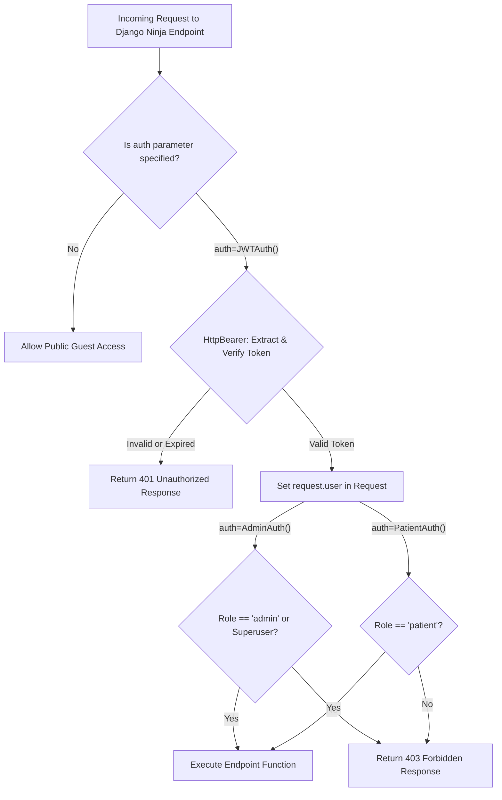

# Rafikni Platform - RESTful API Architectural Requirements & Best Practices
# API v1 Engineering Specifications with Django Ninja

---

## 📌 1. Architectural Overview & Framework Selection

This document establishes the comprehensive engineering standards, architectural patterns, and strict development guidelines for building the **RESTful API (v1)** for the **Rafikni (رافقني)** platform. The API serves as the backend engine for the native Android mobile application and external client services, while strictly adhering to the project rules defined in `AGENTS.md`.

### 🚀 Core Framework: Django Ninja (`django-ninja`)
The API framework chosen for this project is **Django Ninja**. Django Ninja is selected for the following architectural advantages:
- **Function-Based Approach:** Django Ninja uses pure function-based endpoint definitions (`@router.get`, `@router.post`), perfectly fulfilling the project mandate in `AGENTS.md` (*"Favor Function-Based Views unless Class-Based Views are explicitly requested"*).
- **Type Hints & Pydantic Validation:** Strict request/response typing and automatic validation using Pydantic schemas.
- **High Performance:** Up to 2-3x faster than Django REST Framework (DRF), optimized for low-latency mobile communication.
- **ASGI & Sync/Async Native:** Full compatibility with Daphne and ASGI deployment already present in `core/asgi.py`.
- **Automatic OpenAPI / Swagger Documentation:** Live interactive documentation automatically served at `/api/v1/docs` and `/api/v1/redoc`.
- **Modular Routing (`Router`):** Clean separation of concerns through sub-routers for each business domain.

### Core Engineering Principles:
1. **RTL & Arabic-First User Experience:** All end-user-facing strings, client error messages, and response feedback returned within the API payload must be in clear modern standard Arabic, matching the platform's target audience.
2. **Strict Role-Based Access Control (RBAC):** Every endpoint must enforce access control according to the user's role (`admin`, `doc`, `patient`, or unauthenticated `guest`) using Django Ninja's `HttpBearer` security system.
3. **Data Integrity & Atomic Transactions:** Any multi-step database persistence (such as creating a medical case alongside a payment receipt, or reviewing and approving a payment linked to course enrollments) must strictly run inside `transaction.atomic()`.
4. **Unified Response Envelope:** Every single endpoint across the API must return a standardized JSON structure:
   ```json
   {
       "success": true,
       "message": "تمت العملية بنجاح",
       "errors": [],
       "data": {}
   }
   ```
5. **Stateless JWT Authentication:** Mobile clients authenticate using standard JSON Web Tokens (via `pyjwt==2.10.1`), integrated directly into Django Ninja's `HttpBearer` authentication.

---

## 📐 2. Unified Response Envelope Standard

Every API endpoint must respond with the standardized JSON structure specified in `AGENTS.md`. Direct or ad-hoc JSON dictionaries are strictly prohibited.

### 2.1 Schema Definition (Pydantic Base Schema)
```python
from typing import Any, Generic, List, Optional, TypeVar
from ninja import Schema

T = TypeVar("T")

class ApiResponseSchema(Schema, Generic[T]):
    success: bool = True
    message: str = "تمت العملية بنجاح"
    errors: List[str] = []
    data: Optional[T] = None
```

```json
{
    "success": true,
    "message": "Human-readable Arabic status message",
    "errors": [],
    "data": {}
}
```

### 2.2 Field Specifications
| Field | Type | Required | Description |
| :--- | :--- | :---: | :--- |
| **`success`** | `boolean` | Yes | `true` when the operation succeeds; `false` on validation, authorization, or runtime failure. |
| **`message`** | `string` | Yes | A user-facing status message in Arabic describing the outcome (e.g., `"تم تسجيل الدخول بنجاح"`). |
| **`errors`** | `array of strings` | Yes | List of user-friendly Arabic error strings. Empty (`[]`) upon success. |
| **`data`** | `object / array / null` | Yes | The payload containing domain data, lists, or pagination metadata. |

### 2.3 HTTP Status Codes Mapping
| Status Code | Meaning | Rafikni API Usage |
| :---: | :--- | :--- |
| **`200 OK`** | Request Succeeded | Successful `GET` queries, updates (`PUT`/`PATCH`), and deletions (`DELETE`). |
| **`201 Created`** | Resource Created | Successful creation of a user, medical case, payment, course, or game order. |
| **`400 Bad Request`** | Input Validation Error | Missing required fields, password mismatch, invalid file format, or malformed data. |
| **`401 Unauthorized`** | Authentication Required | Missing, invalid, expired, or tampered JWT Bearer token. |
| **`403 Forbidden`** | Insufficient Permissions | User is authenticated but lacks required role (e.g., patient accessing admin tools, or banned user). |
| **`404 Not Found`** | Resource Not Found | Querying non-existent medical cases, courses, articles, or users. |
| **`405 Method Not Allowed`**| Method Mismatch | Sending `GET` to a `POST`-only endpoint. |
| **`422 Unprocessable`** | Business Logic Failure | Gemini AI quota exhaustion, invalid state transitions, or business rule conflicts. |
| **`500 Internal Error`** | Server Error | Unhandled server exceptions (must be caught via `try...except` and logged to `logger.error`). |

---

## 🔐 3. Authentication & Role-Based Access Control (RBAC) in Django Ninja

### 3.1 JWT (JSON Web Tokens) Implementation with `HttpBearer`
Django Ninja natively supports bearer token authentication through `ninja.security.HttpBearer`. We implement custom security classes in `api/security.py`:

```python
from ninja.security import HttpBearer
from api.jwt_auth import decode_token
from django.contrib.auth.models import User

class JWTAuth(HttpBearer):
    """Base JWT Authentication for Django Ninja."""
    def authenticate(self, request, token):
        payload = decode_token(token)
        if not payload or payload.get("type") != "access":
            return None
        try:
            user = User.objects.select_related("profile").get(id=payload["user_id"], is_active=True)
            request.user = user
            return user
        except User.DoesNotExist:
            return None

class AdminAuth(JWTAuth):
    """Requires authenticated user with admin role or superuser."""
    def authenticate(self, request, token):
        user = super().authenticate(request, token)
        if user and (user.is_superuser or getattr(user.profile, "role", None) == "admin"):
            return user
        return None

class PatientAuth(JWTAuth):
    """Requires authenticated user with patient role."""
    def authenticate(self, request, token):
        user = super().authenticate(request, token)
        if user and getattr(user.profile, "role", None) == "patient":
            return user
        return None
```

- **Access Token:**
  - Lifetime: 60 minutes.
  - Payload: `{"user_id": int, "username": str, "role": str, "exp": timestamp, "type": "access"}`.
  - Header: `Authorization: Bearer <access_token>`.
- **Refresh Token:**
  - Lifetime: 30 days.
  - Payload: `{"user_id": int, "exp": timestamp, "type": "refresh"}`.
  - Endpoint: `POST /api/v1/auth/token/refresh/` for silent renewal on mobile.

### 3.2 RBAC Matrix
The platform defines three roles in `UserProfile.RoleChoices`:
1. `admin`: Full administrative access (user management, payments review, AI treatment plan generation, curriculum publishing, COD orders tracking).
2. `doc`: Certified specialist/doctor (profile directory listing, course access, consultation capabilities).
3. `patient`: Family/Guardian/Patient (manages own profile, creates medical cases with payment receipts, enrolls in courses, views approved AI treatment plans, places COD store orders).
4. `guest`: Unauthenticated visitor (browses public courses, articles, games catalog, public doctor directory, Algerian geographic data, places guest COD orders).



---

## ⚡ 4. Strict Business Logic Mandates

In strict compliance with `AGENTS.md`:

### 4.1 Payment Creation & Atomic Transactions Mandate
- **Rule:** Every payment record **must** be created using the `create_payment` helper defined in `dashboard.utils`.
- **Rule:** Every call to `create_payment` **must** be wrapped inside `with transaction.atomic():`.
- Direct invocation of `Payment.objects.create(...)` is forbidden in business workflows.
```python
from django.db import transaction
from dashboard.utils import create_payment

with transaction.atomic():
    case = ChildMedicalCase.objects.create(...)
    payment = create_payment(
        user=request.user,
        content_object=case,
        receipt_image=receipt_file
    )
```

### 4.2 Payment Review Synchronization
When an administrator reviews a payment (`approve` or `reject`):
- For `CourseEnrollment`:
  - `payment.status` is set to `APPROVED` or `REJECTED`.
  - `enrollment.status` is synchronized to `APPROVED` or `REJECTED`.
  - `enrollment.approved_by` and `enrollment.approved_at` are recorded.
- For `MedicalCase` (`ChildMedicalCase`, `AdultMedicalCase`, `ElderlyMedicalCase`):
  - `payment.status` is set to `APPROVED` or `REJECTED`.
  - `case.is_approved` is synchronized to `True` (on approval) or `False` (on rejection).
- Immediate user notification is triggered via `dashboard.utils.notify_user`.

### 4.3 AI Treatment Plan Generation via Gemini API
- Restricted exclusively to administrators (`auth=AdminAuth()`).
- Executes `dashboard.gemini_utils.generate_treatment_plan(case)`.
- Validates the JSON response against the 5 mandatory clinical sections:
  1. Assessment (`التقييم`)
  2. Goals (`الأهداف`)
  3. Treatment Plan (`الخطة العلاجية`)
  4. Recommendations (`توصيات`)
  5. Follow-up (`المتابعة`)
- Saves/updates the record via `TreatmentPlan.objects.update_or_create(...)`.
- Dispatches a real-time notification to the patient.
- Gracefully handles Google Gemini free tier rate limits / quota exhaustion with clear Arabic error messaging.

### 4.4 Course Free Video Preview
- The first video (`order == 0` or single video) is marked `is_free = True`.
- Unenrolled users and public guests can stream only free preview videos.
- Paid videos require an active, approved enrollment (`CourseEnrollment.status == 'approved'`) or admin status.

### 4.5 Cash on Delivery (COD) Store Orders
- Guests and authenticated users can place COD orders for therapeutic games.
- Wilaya and Commune inputs are strictly validated against `algeria.json`.
- Automatic administrative alerts are sent to all platform admins upon order placement.

---

## 📁 5. Media & File Upload Specifications in Django Ninja

1. **Native Django Ninja File Handling:** Endpoints receiving binary uploads use `ninja.File` and `ninja.UploadedFile`:
   ```python
   from ninja import File, UploadedFile

   @router.post("/medical-cases/")
   def create_medical_case(
       request,
       receipt_image: UploadedFile = File(...)
   ):
       ...
   ```
2. **File Validation:**
   - Image formats: `image/jpeg`, `image/png`, `image/webp`.
   - Payment receipts also accept `application/pdf`.
   - Upload sizes are validated against settings (`FILE_UPLOAD_MAX_MEMORY_SIZE = 2.5MB`).
3. **Absolute URLs in Responses:** All media fields returned in Pydantic schemas must be converted to full absolute URLs using `request.build_absolute_uri()`.

---

## 📡 6. Real-Time Push & EventStream (SSE)

- Built upon `django-eventstream` connected via Daphne ASGI.
- Endpoint:
  ```http
  GET /events/?channel=user-{user_id}
  ```
- **Security Rule:** Users are strictly isolated to their own channel `user-{user_id}` via channel manager authentication.
- Events emitted: `notification` (contains notification ID, title, Arabic message, notification type, and navigation deep link).

---

## 🏛️ 7. API Architecture & Directory Structure with Django Ninja

The API is structured using Django Ninja routers under the `api/` package:

```text
api/
├── __init__.py
├── main.py                   # NinjaAPI instance (title="Rafikni API", docs_url="/docs")
├── urls.py                   # Connects NinjaAPI to Django URL routing
├── security.py               # HttpBearer JWTAuth, AdminAuth, PatientAuth
├── jwt_auth.py               # Token encoding, decoding, expiration handling
├── schemas/                  # Pydantic request and response schemas
│   ├── __init__.py
│   ├── common.py             # ApiResponseSchema, PaginationSchema
│   ├── auth.py               # Login, Signup, Profile, Token schemas
│   ├── cases.py              # Child, Adult, Elderly schemas
│   ├── plans.py              # Treatment plan schemas
│   ├── courses.py            # Course, Video, Enrollment schemas
│   ├── payments.py           # Payment, Receipt review schemas
│   ├── games.py              # Game, GameOrder schemas
│   ├── articles.py           # Article schemas
│   ├── notifications.py      # Notification schemas
│   ├── users.py              # User management schemas
│   ├── geo.py                # Wilaya and Commune schemas
│   └── analytics.py          # Dashboard KPIs schemas
└── routers/                  # Modular Django Ninja Router controllers
    ├── __init__.py
    ├── auth.py               # /api/v1/auth/
    ├── medical_cases.py      # /api/v1/medical-cases/
    ├── treatment_plans.py    # /api/v1/treatment-plans/
    ├── courses.py            # /api/v1/courses/
    ├── payments.py           # /api/v1/payments/
    ├── games.py              # /api/v1/games/
    ├── articles.py           # /api/v1/articles/
    ├── notifications.py      # /api/v1/notifications/
    ├── users.py              # /api/v1/users/
    ├── geo.py                # /api/v1/geo/
    └── analytics.py          # /api/v1/analytics/
```

In `api/main.py`:
```python
from ninja import NinjaAPI
from api.routers.auth import router as auth_router
from api.routers.medical_cases import router as cases_router
from api.routers.treatment_plans import router as plans_router
from api.routers.courses import router as courses_router
from api.routers.payments import router as payments_router
from api.routers.games import router as games_router
from api.routers.articles import router as articles_router
from api.routers.notifications import router as notifications_router
from api.routers.users import router as users_router
from api.routers.geo import router as geo_router
from api.routers.analytics import router as analytics_router

api = NinjaAPI(
    title="Rafikni API",
    version="1.0.0",
    description="Official REST API for Rafikni Platform (Android & Web)",
    docs_url="/docs",
)

api.add_router("/auth", auth_router, tags=["Authentication & Profile"])
api.add_router("/medical-cases", cases_router, tags=["Medical Cases"])
api.add_router("/treatment-plans", plans_router, tags=["AI Treatment Plans"])
api.add_router("/courses", courses_router, tags=["Courses & Video Academy"])
api.add_router("/payments", payments_router, tags=["Payments & Receipts"])
api.add_router("/games", games_router, tags=["Games Store & COD Orders"])
api.add_router("/articles", articles_router, tags=["Articles & Blog"])
api.add_router("/notifications", notifications_router, tags=["Real-Time Notifications"])
api.add_router("/users", users_router, tags=["User & Doctor Management"])
api.add_router("/geo", geo_router, tags=["Algerian Geographic Data"])
api.add_router("/analytics", analytics_router, tags=["Admin Dashboard Analytics"])
```

---

## 🧪 8. Testing & Quality Assurance Standards

1. **Test Coverage:** Every Django Ninja endpoint must have automated unit/integration tests using Django's test client (`client.get`, `client.post`), verifying:
   - Happy path with `200 OK` or `201 Created`.
   - Unauthorized access with `401 Unauthorized`.
   - Forbidden role access with `403 Forbidden`.
   - Validation failures with `400 Bad Request` or `422 Unprocessable`.
   - Atomic rollback verification on multi-step transactions.
2. **Interactive OpenAPI Specs:** Swagger UI available at `/api/v1/docs` for developer exploration and Android client integration.
3. **Documentation Integrity:** Every function-based endpoint in the router must include a detailed docstring specifying purpose, RBAC level, parameters, and response structure.
