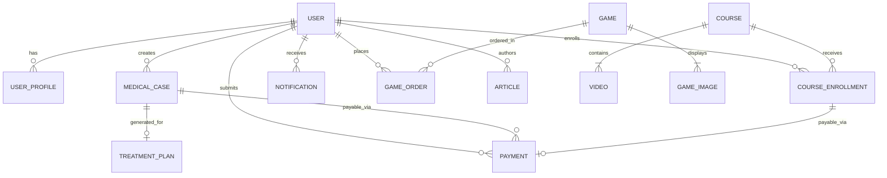
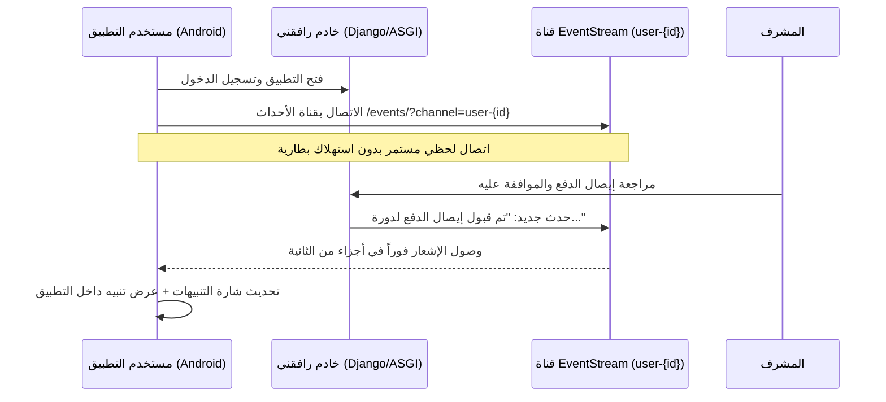

# وثيقة المتطلبات والمواصفات الشاملة لتطبيق رافقني (Android App Specification)
# Rafikni Platform - Mobile Application Requirements & Design System

---

## 📑 فهرس المحتويات
1. [نظرة عامة على المشروع (Executive Summary)](#1-نظرة-عامة-على-المشروع)
2. [النظام التصميمي والهوية البصرية (Design System & Branding)](#2-النظام-التصميمي-والهوية-البصرية)
    - [شعار المنصة (Logo & Brand Assets)](#21-شعار-المنصة)
    - [لوحة الألوان الأساسية والثانوية (Color Palette)](#22-لوحة-الألوان)
    - [الطباعة والخطوط (Typography)](#23-الطباعة-والخطوط)
    - [مكونات الواجهة وتأثير الزجاج (Glassmorphism & UI Components)](#24-مكونات-الواجهة)
    - [الأيقونات والرسومات (Iconography)](#25-الأيقونات)
3. [هندسة النظام وهيكل البيانات (Data Models & Architecture)](#3-هندسة-النظام-وهيكل-البيانات)
4. [مصفوفة الأدوار والصلاحيات (Role-Based Access Control)](#4-مصفوفة-الأدوار-والصلاحيات)
5. [المواصفات التفصيلية للميزات والشاشات (Feature Specifications)](#5-المواصفات-التفصيلية-للميزات-والشاشات)
    - [وحدة المصادقة والحسابات (Authentication & Account Management)](#51-وحدة-المصادقة-والحسابات)
    - [وحدة الحالات الطبية (Medical Cases Management)](#52-وحدة-الحالات-الطبية)
    - [محرك الخطط العلاجية بالذكاء الاصطناعي (AI Treatment Plans Engine)](#53-محرك-الخطط-العلاجية-بالذكاء-الاصطناعي)
    - [الأكاديمية والدورات التدريبية (Courses & Video Player)](#54-الأكاديمية-والدورات-التدريبية)
    - [نظام المدفوعات والإيصالات (Generic Payments System)](#55-نظام-المدفوعات-والإيصالات)
    - [متجر الألعاب التعليمية والدفع عند الاستلام (COD Educational Games Store)](#56-متجر-الألعاب-التعليمية)
    - [المدونة والمقالات التوعوية (Articles & Health Knowledge Base)](#57-المدونة-والمقالات)
    - [نظام الإشعارات اللحظية (Real-time Push & EventStream Notifications)](#58-نظام-الإشعارات-اللحظية)
    - [لوحة تحكم المشرف على التطبيق (Admin Mobile Dashboard)](#59-لوحة-تحكم-المشرف)
6. [بيانات الولايات والبلديات الجزائرية (Algerian Geographic Data Engine)](#6-بيانات-الولايات-والبلديات-الجزائرية)
7. [المواصفات التقنية لتطبيق الأندرويد (Android Technical Architecture)](#7-المواصفات-التقنية-لتطبيق-الأندرويد)
8. [متطلبات الأمان والخصوصية (Security & Compliance)](#8-متطلبات-الأمان-والخصوصية)

---

## 1. نظرة عامة على المشروع

### 1.1 التعريف بالمنصة
**منصة رافقني (Rafikni)** هي المنصة الرقمية الطبية والنفسية الأولى المتخصصة في الجزائر لدعم الأسرة والطفل، مع التركيز على تأهيل ودعم ذوي الاحتياجات الخاصة:
- **طيف التوحد (Autism Spectrum)**
- **فرط الحركة وتشتت الانتباه (ADHD)**
- **اضطرابات النطق والتخاطب (الأرطفونيا - Speech Therapy)**
- **الحبسة الكلامية (Aphasia)**
- **المتلازمات والإعاقات الذهنية (Down Syndrome, Intellectual Disabilities)**
- **أمراض الشيخوخة الإدراكية (Alzheimer & Parkinson)**

### 1.2 أهداف تطبيق الأندرويد
يهدف تطبيق الأندرويد إلى نقل كافة خدمات وتجربة منصة رافقني إلى تطبيق أصيل (Native Android Application) عالي السرعة، يدعم اللغة العربية بشكل كامل (RTL First)، ويعمل بكفاءة عبر مختلف الأجهزة الذكية لتسهيل متابعة الخطط العلاجية، مشاهدة الدورات، طلب الألعاب التعليمية، ورفع الإيصالات المالية في أي وقت.

---

## 2. النظام التصميمي والهوية البصرية

### 2.1 شعار المنصة
- **النص البصري للشعار:** "رافقني" بخط عريض متدرج (Gradient Brand Text).
- **التدرج اللوني للشعار:**
  - نقطة البداية: `#06b6d4` (Cyan / Primary Light).
  - نقطة النهاية: `#10b981` (Emerald Green / Accent).
- **أيقونة التطبيق (App Icon):**
  - ملف المصدر الحالي: `static/img/logo.jpg`.
  - أيقونة أندرويد التكيفية (Adaptive Icon): خلفية بيضاء نقية مع إبراز شعار رافقني المتدرج، وتوفير نسخة مصغرة للأجهزة أحادية اللون (Monochrome Themed Icon) لنظام Android 13+.

### 2.2 لوحة الألوان

| المعرّف (Token) | رمز اللون (HEX) | الاستخدام وتدرج المعنى | التطبيق في Jetpack Compose / XML |
| :--- | :--- | :--- | :--- |
| **`Primary`** | `#06b6d4` | اللون الأساسي للمنصة (Cyan النضر) للأزرار الرئيسية وشريط التنقل | `Color(0xFF06B6D4)` |
| **`PrimaryDark`** | `#0891b2` | تدرج داكن للضغط والأشرطة العلوية وحالات Hover/Active | `Color(0xFF0891B2)` |
| **`PrimaryLight`** | `#22d3ee` | إضاءات وتدرجات الشعار والبطاقات المميزة | `Color(0xFF22D3EE)` |
| **`DashboardBlue`** | `#0d6efd` | أزرق لوحة التحكم القياسي، أيقونات الرعاية والمودالز | `Color(0xFF0D6EFD)` |
| **`Accent`** | `#10b981` | اللون التأكيدي الأخضر الزمردي، للعمليات الناجحة والشهادات | `Color(0xFF10B981)` |
| **`AccentDark`** | `#059669` | درجات التركيز للأخضر التأكيدي | `Color(0xFF059669)` |
| **`Success`** | `#198754` | حالات القبول (حالة طبية مقبولة، دفع مؤكد، تسجيل مفعل) | `Color(0xFF198754)` |
| **`Warning`** | `#f59e0b` / `#ffc107` | التنبيهات وحالات "قيد المراجعة" (Pending) والتقييمات | `Color(0xFFF59E0B)` |
| **`Danger`** | `#dc3545` | الأخطاء، الرفض، الحظر، تأكيد الحذف عبر التنبيهات | `Color(0xFFDC3545)` |
| **`Background`** | `#f8fafc` | خلفية التطبيق الأساسية المريحة للعين (Slate 50) | `Color(0xFFF8FAFC)` |
| **`SurfaceCard`** | `#ffffff` | بطاقات المحتوى البيضاء الصلبة | `Color(0xFFFFFFFF)` |
| **`GlassCard`** | `rgba(255, 255, 255, 0.85)` | خلفية كروت التأثير الزجاجي (Glassmorphism) مع Blur | `Color(0xD9FFFFFF)` |
| **`TextPrimary`** | `#1e293b` | النص الرئيسي عالي التباين (Slate 800) | `Color(0xFF1E293B)` |
| **`TextMuted`** | `#475569` | النصوص الفرعية والتوضيحية والتواريخ (Slate 600) | `Color(0xFF475569)` |
| **`TextSubtle`** | `#64748b` | العناصر غير النشطة والأوصاف المصغرة | `Color(0xFF64748B)` |
| **`BorderSoft`** | `rgba(6, 182, 212, 0.15)` | الحدود الناعمة للبطاقات وحقول الإدخال | `Color(0x2606B6D4)` |
| **`TherapyPurple`** | `#6f42c1` | بطاقات وإجراءات الخطط العلاجية بالذكاء الاصطناعي | `Color(0xFF6F42C1)` |

### 2.3 الطباعة والخطوط (Typography)
- **الخط العربي الأساسي:** **Tajawal (تجوّل)** بجميع أوزانه:
  - `Tajawal-Regular` (400): للنصوص الطويلة والشروحات ومحتوى المقالات.
  - `Tajawal-Medium` (500): لحقول الإدخال، عناصر القوائم، وتسميات الأزرار الثانوية.
  - `Tajawal-Bold` (700): للعناوين الرئيسية، أسعار الدورات، وحالات الإشعارات.
  - `Tajawal-ExtraBold` (800): للشعار وعناوين الأقسام الكبرى في شاشات الترحيب.
- **الخط الثانوي والأرقام:** **Inter** لتنسيق الأرقام والأسعار والمدد الزمنية للفيديوهات.
- **قواعد الكتابة:**
  - اللغة الأساسية: العربية الفصحى المبسطة (`ar-DZ` / `ar-SA`).
  - المحاذاة: الاتجاه الإجباري من اليمين إلى اليسار (RTL).
  - استخدام علامات الترقيم العربية والفواصل العربية الفصيحة.

### 2.4 مكونات الواجهة وتأثير الزجاج (Glassmorphism & UI Components)

1. **البطاقة الزجاجية (Glassmorphic Card):**
   - نصف قطر الحواف: `24dp` (`border-radius: 24px`).
   - الخلفية: طبقة بيضاء بنفاذية 85% مع تأثير تمويه خلفي (`RenderEffect.createBlurEffect(12f, 12f)`).
   - الحد الخارجي: حد رفيع بنفاذية 30% من اللون الأبيض أو السماوي.
   - الظل: ظل ناعم متعدد الطبقات يرتفع عند الضغط (`Elevation 4dp -> 8dp`).

2. **حقل الاختيار المخصص الفائق (Ultra Styled Select):**
   - بديل لجميع قوائم `Spinner` الافتراضية.
   - يتضمن أيقونة معبرة في البداية، اسم القيمة المختارة، وسهم متحرك يدور بزاوية 180 درجة عند الفتح.
   - قائمة خيارات منبثقة ذات زوايا دائرية، مع تظليل ناعم للخيار النشط باللون السماوي.

3. **حاوية رفع الصور والملفات الفائقة (Ultra Image Upload):**
   - أبعاد الحاوية: مربع بمقاس `150dp × 150dp` وبزوايا مستديرة `24dp`.
   - الإطار: إطار متقطع (Dashed Border) باللون السماوي الناعم.
   - حالة الفراغ: أيقونة سحابة الرفع مع تدرج لوني ونص "اضغط لاختيار صورة".
   - حالة التحديد: عرض معاينة الصورة كاملة مع ميزة الاقتصاص (Crop) وتراكب شفاف (Overlay) يحتوي على أيقونة كاميرا مع نص "تغيير الصورة".

4. **الزر العائم للوحة التحكم (Dashboard Floating Toggle):**
   - زر عائم دائري ذو حركة نبضية (`Pulse Animation`) بلون أزرق ساطع، يمكن سحبه أو تثبيته لفتح قائمة التنقل السريعة.

5. **شاشات الحوار والتأكيد (Modal & Confirmation Dialogs):**
   - استخدام نوافذ تأكيد بنمط SweetAlert لجميع عمليات الحذف (مع أيقونة تحذيرية حمراء، وزري "نعم، احذف" و"إلغاء").

---

## 3. هندسة النظام وهيكل البيانات (Data Models & Architecture)



### 3.1 الكيانات الجوهرية (Domain Entities)

#### 1. ملف المستخدم (`UserProfile`)
- `id`: المعرف الرقمي.
- `user`: ارتباط مباشر بمستخدم النظام (اسم المستخدم، الاسم الأول، اسم العائلة، البريد الإلكتروني).
- `role`: دور المستخدم (`admin` مدير، `doc` طبيب/أخصائي، `patient` مريض/ولي أمر).
- `birthdate`: تاريخ الميلاد.
- `phone_number`: رقم الهاتف الجزائري.
- `profile_pic`: رابط الصورة الشخصية المخزنة.

#### 2. الحالات الطبية (`BaseMedicalCase`, `Child`, `Adult`, `Elderly`)
- **البيانات المشتركة:**
  - `user_id`: صاحب الحالة (مريض).
  - `full_name`: الاسم الكامل لصاحب الحالة.
  - `age`: العمر بالسنوات.
  - `gender`: الجنس (`male` ذكر / `female` أنثى).
  - `aphasie`: مصاب بحبسة كلامية أم لا (`Boolean`).
  - `is_approved`: حالة اعتماد الملف الطبي من قبل الإدارة بعد دفع الرسوم (`Boolean`).
- **حالة الطفل (`ChildMedicalCase`):**
  - `disorders`: الاضطرابات السلوكية والنمائية (توحد، فرط حركة وتشتت انتباه...).
  - `syndromes`: المتلازمات الوراثية (متلازمة داون، ويليامز...).
  - `intellectual_disability`: درجة الإعاقة الذهنية (`weak` خفيف، `middle` متوسط، `hard` شديد).
- **حالة البالغ (`AdultMedicalCase`):**
  - تتبع الحبسة الكلامية والصدمات الحركية والتأهيل بعد الجلطات.
- **حالة المسن (`ElderlyMedicalCase`):**
  - `alzheimer`: مصاب بألزهايمر (`Boolean`).
  - `parkinson`: مصاب بباركنسون (`Boolean`).

#### 3. الخطة العلاجية الذكية (`TreatmentPlan`)
- `content_type` & `object_id`: ارتباط متعدد بأي من الحالات الطبية (طفل / بالغ / مسن).
- `plan_data`: كائن JSON منظم ينتجه نموذج Gemini AI، يحتوي على الأقسام الخمسة:
  - `التقييم`: الوصف السريري والتشخيص الأولي.
  - `الأهداف`: أهداف تأهيلية قصيرة وطويلة المدى.
  - `الخطة العلاجية`: تمارين وأنشطة منزلية وسريرية مقترحة.
  - `التوصيات`: إرشادات للأولياء ومقدمي الرعاية.
  - `المتابعة`: جدول التقييم الدوري وقياس التقدم.
- `created_by`: المشرف أو الطبيب المولد للخطة.
- `created_at` & `updated_at`: الطوابع الزمنية للتوليد والتحديث.

#### 4. الدورات والفيديوهات التعليمية (`Course`, `Video`, `CourseEnrollment`)
- **الدورة (`Course`):** العنوان، السعر بالدينار الجزائري (0 للدورات المجانية)، اسم المعلم/الأخصائي، الوصف، الوسوم (Tags)، صورة الغلاف، تاريخ الإنشاء.
- **الفيديو (`Video`):** تابع للدورة، العنوان، الوصف، ملف الفيديو (`MP4`)، المدة الزمنية، الترتيب التسلسلي (`order`)، وعلامة مجاني (`is_free` - الفيديو الأول دائماً متاح للمعاينة المجانية).
- **التسجيل في الدورة (`CourseEnrollment`):** ارتباط بين المستخدم والدورة، الحالة (`pending` قيد الانتظار، `approved` مقبول، `rejected` مرفوض)، تاريخ التسجيل، والمعتمد بواسطة.

#### 5. المدفوعات الموحدة (`Payment`)
- الربط المتعدد (`Generic Relation`): إما بدورة تعليمية (`CourseEnrollment`) أو بحالة طبية (`MedicalCase`).
- `receipt_image`: صورة إيصال التحويل (بريدي موب BaridiMob / حوالة CCP / وصل بنكي).
- `status`: حالة الإيصال (`pending` قيد المراجعة، `approved` مقبول، `rejected` مرفوض).
- `reviewed_by`: المشرف الذي قام بفحص الوصل والموافقة عليه.
- `reviewed_at`: تاريخ المراجعة.

#### 6. متجر الألعاب والطلبات (`Game`, `GameImage`, `GameOrder`)
- **اللعبة (`Game`):** العنوان، الرابط الدائم (`slug`)، السعر (د.ج)، الوصف التفصيلي، الوسوم، الصورة البارزة، وحالة التوفر.
- **معرض الصور (`GameImage`):** صور متعددة لكل لعبة لإتاحة تصفحها كألبوم.
- **طلب اللعبة (`GameOrder`):** نظام الدفع عند الاستلام (COD):
  - اسم الزبون الكامل، رقم الهاتف الجزائري.
  - الولاية والبلدية والعنوان التفصيلي.
  - حالة الطلب (`pending` قيد الانتظار، `confirmed` تم التأكيد، `delivered` تم التوصيل، `cancelled` ملغى).
  - المستخدم (اختياري، يتيح الطلب السريع للزوار أو للمسجلين).

#### 7. المقالات التوعوية (`Article`)
- العنوان، الرابط المختصر، المحتوى المنسق، الفئة العمرية/الزمنية (`before_birth` قبل الولادة، `during_birth` أثناء الولادة، `after_birth` بعد الولادة)، صورة الغلاف، الكاتب، وحالة النشر.

#### 8. الإشعارات اللحظية (`Notification`)
- العنوان، نص الرسالة، النوع (`info`, `success`, `warning`, `error`)، رابط التوجيه عند النقر، حالة القراءة (`is_read`)، وتاريخ الإرسال.

---

## 4. مصفوفة الأدوار والصلاحيات (Role-Based Access Control)

| الميزة / الشاشة | ولي الأمر / المريض (`patient`) | الطبيب / الأخصائي (`doc`) | مدير المنصة (`admin`) | الزائر غير المسجل (Guest) |
| :--- | :---: | :---: | :---: | :---: |
| **تصفح الصفحة الرئيسية والمتجر والمقالات** | ✅ | ✅ | ✅ | ✅ |
| **مشاهدة المعاينة المجانية للدورات** | ✅ | ✅ | ✅ | ✅ |
| **شراء الألعاب والدفع عند الاستلام (COD)** | ✅ | ✅ | ✅ | ✅ |
| **إنشاء حساب وتأكيده عبر البريد** | ✅ | ❌ (ينشئه المدير) | ❌ | ✅ |
| **إضافة حالة طبية ورفع إيصال الدفع** | ✅ | ❌ | ✅ (للاختبار) | ❌ |
| **استعراض الحالات الطبية الخاصة به** | ✅ | ❌ | ✅ (يرى كل الحالات) | ❌ |
| **الاطلاع على الخطة العلاجية المعتمدة** | ✅ (لحالاته المعتمدة) | ✅ | ✅ | ❌ |
| **توليد خطة علاجية بالذكاء الاصطناعي (Gemini)**| ❌ | ❌ | ✅ | ❌ |
| **التسجيل بالدورات ورفع إيصال الحوالة** | ✅ | ✅ | ✅ | ❌ |
| **مشاهدة كامل فيديوهات الدورة بعد القبول**| ✅ (للدورات المقبولة) | ✅ | ✅ | ❌ |
| **مراجعة الإيصالات (قبول / رفض الدفع)** | ❌ | ❌ | ✅ | ❌ |
| **إدارة طلبات الألعاب وتغيير حالتها** | ❌ | ❌ | ✅ | ❌ |
| **إنشاء وإدارة الدورات والفيديوهات والمقالات**| ❌ | ❌ | ✅ | ❌ |
| **إضافة حسابات الأطباء وإرسال بياناتهم** | ❌ | ❌ | ✅ | ❌ |
| **تلقي التنبيهات الحية (EventStream/SSE)** | ✅ | ✅ | ✅ | ❌ |

---

## 5. المواصفات التفصيلية للميزات والشاشات

### 5.1 وحدة المصادقة والحسابات

```
+-------------------------------------------------------------+
|                         رافقني                              |
|                    مرحباً بعودتك!                           |
|        سجل الدخول للمتابعة إلى حسابك في رافقني             |
|                                                             |
|   [ 👤  اسم المستخدم                                     ]  |
|   [ 🔒  كلمة المرور                                   👁️ ]  |
|                                                             |
|   [ ] تذكرني                         نسيت كلمة المرور؟      |
|                                                             |
|   +-----------------------------------------------------+   |
|   |                   تسجيل الدخول                      |   |
|   +-----------------------------------------------------+   |
|                                                             |
|   ليس لديك حساب؟ إنشاء حساب جديد                           |
+-------------------------------------------------------------+
```

1. **شاشة تسجيل الدخول (Login):**
   - حقول: اسم المستخدم، كلمة المرور مع إمكانية إظهار/إخفاء النص.
   - خيار "تذكرني" لحفظ مفاتيح الجلسة بأمان في Keystore / DataStore.
   - التحقق من تفعيل الحساب: إذا كان المستخدم مسجلاً ولكنه لم يفعل بريده الإلكتروني بعد، تظهر رسالة عربية: *"يرجى تفعيل حسابك من خلال البريد الإلكتروني أولاً"*.
   - التوجيه بعد النجاح بناءً على الدور (إلى شاشة المريض الرئيسية أو لوحة المشرف).

2. **شاشة إنشاء الحساب (Sign Up):**
   - حقول: اسم المستخدم، البريد الإلكتروني، كلمة المرور، تأكيد كلمة المرور.
   - الفحص التفاعلي أثناء الكتابة لتطابق كلمتي المرور وتوفر اسم المستخدم والبريد.
   - السلوك بعد الإرسال: إنشاء الحساب بحالة غير نشطة (`is_active = False`)، إرسال رابط التفعيل، وإظهار نافذة تأكيد لطيفة تدعو المستخدم لتفقد بريده.

3. **شاشة استعادة كلمة المرور (Forgot / Reset Password):**
   - إدخال البريد الإلكتروني وإرسال رابط/رمز آمن مشفر (`uidb64/token`).
   - شاشة تعيين كلمة المرور الجديدة مع تأكيدها والعودة للدخول.

4. **شاشة الملف الشخصي وتحديثه (Profile Screen):**
   - عرض وتعديل: الاسم الأول، اللقب، البريد، رقم الهاتف، تاريخ الميلاد.
   - تعديل الصورة الشخصية باستخدام مكون `Ultra Image Upload` المدمج مع مكتبة اختيار الصور الخاصة بنظام أندرويد الحديثة (Photo Picker API).

---

### 5.2 وحدة الحالات الطبية (Medical Cases)

1. **شاشة إضافة حالة طبية جديدة (Create Case):**
   - خطوة تفاعلية سلسة تسمح لولي الأمر بتسجيل طفله أو مريضه.
   - **البيانات العامة:**
     - الاسم الكامل للمريض.
     - الفئة العمرية عبر `Ultra Select`: طفل (Child)، بالغ (Adult)، مسن (Elderly).
     - العمر بالسنوات.
     - الجنس: ذكر أو أنثى.
     - مفتاح تبديل: مصاب بحبسة كلامية (Aphasia).
   - **الحقول المشروطة حسب الفئة:**
     - *عند اختيار "طفل":* تظهر حقول نصية متعددة الأسطر للاضطرابات (مثل: توحد، تشتت انتباه)، حقل المتلازمات (مثل: داون)، وقائمة منسدلة لدرجة الإعاقة الذهنية (خفيف، متوسط، شديد).
     - *عند اختيار "مسن":* يظهر مفتاحان للتبديل: مصاب بألزهايمر، مصاب بباركنسون.
   - **إرفاق إيصال الرسوم الطبية (Payment Attachment):**
     - رفع صورة إيصال التحويل عبر الكاميرا أو المعرض (إجباري لإتمام الإرسال).
     - يتم حفظ الحالة والإيصال في معاملة واحدة مترابطة (`Atomic Transaction`).
   - تنبيه المشرفين فورياً عبر الإشعارات بوجود حالة جديدة بانتظار الاعتماد.

2. **شاشة استعراض الحالات الطبية (Cases List):**
   - تعرض بطاقات زجاجية منظمة بكل الحالات المسجلة.
   - إشارة واضحة للحالة الطبية:
     - شارة صفراء: *"قيد المراجعة"* (بانتظار فحص الإيصال).
     - شارة خضراء: *"مقبول"* (تم التحقق من الوصل والملف جاهز).
   - أزرار الإجراءات: عرض التفاصيل الكاملة في نافذة منبثقة، استعراض الخطة العلاجية، وحذف الحالة (مع تأكيد SweetAlert).

---

### 5.3 محرك الخطط العلاجية بالذكاء الاصطناعي (AI Treatment Plans Engine)

```
+-------------------------------------------------------------+
| 🧠 الخطة العلاجية الذكية                                    |
| للحالة: أحمد محمد (طفل - 8 سنوات)                           |
+-------------------------------------------------------------+
| [ 📋 التقييم الأولي ]                                       |
| حالة طيف توحد متوسطة مع صعوبات في التواصل اللفظي...          |
|  ✓ تقييم استجابة الطفل للأوامر البسيطة                       |
|  ✓ فحص مستوى الإدراك البصري والتطابق                        |
+-------------------------------------------------------------+
| [ 🎯 الأهداف التأهيلية ]                                    |
| زيادة التركيز والانتباه وتنمية مهارات التعبير النطقي...      |
|  ✓ نطق الكلمات أحادية المقطع خلال 4 أسابيع                  |
|  ✓ التواصل البصري لمدة 10 ثوانٍ متواصلة                     |
+-------------------------------------------------------------+
| [ 🩺 الخطة والتمارين المقترحة ]                             |
| تمارين عضلات الفك وألعاب المحاكاة الحركية اليومية...        |
|  ✓ تمرين النفخ واستخدام المصاصة لتقوية الفك                 |
|  ✓ جلسات مطابقة الصور مع الكلمات 3 مرات أسبوعياً            |
+-------------------------------------------------------------+
| [ 💡 توصيات للأسرة والمربين ]                               |
| تقليل استخدام الشاشات، وإدماج الطفل في أنشطة روتينية...     |
+-------------------------------------------------------------+
| [ 📅 خطة المتابعة ]                                         |
| إعادة التقييم بعد 60 يوماً من بدء التمارين السلوكية...      |
+-------------------------------------------------------------+
|   [ 🔄 إعادة توليد الخطة (Admin) ]       [ 📥 تحميل PDF ]   |
+-------------------------------------------------------------+
```

1. **آلية العمل التقنية (AI Generation Workflow):**
   - للمشرفين: إمكانية النقر على أيقونة الدماغ الذكية `fa-brain` بجانب أي حالة طبية.
   - يقوم النظام بتجميع بيانات المريض وتمريرها في برومبت طبي عربي فائق الدقة إلى نموذج Google Gemini (`gemini-2.0-flash` أو أحدث).
   - يعيد النموذج هيكل بيانات JSON يحتوي على الأقسام الخمسة مع نصوصها وخطواتها التطبيقية (`steps`).
   - يتم حفظ الخطة في جدول `TreatmentPlan` وإرسال إشعار لحظي لحساب المريض ينبهه بأن خطته العلاجية باتت جاهزة.

2. **عرض الخطة في تطبيق الأندرويد:**
   - واجهة مكونة من كروت علاجية أنيقة ملونة:
     - كرت التقييم (أيقونة القائمة - لون أزرق).
     - كرت الأهداف (أيقونة الهدف - لون أخضر زمردي).
     - كرت التمارين السلوكية (أيقونة الملف الطبي - لون بنفسجي `#6f42c1`).
     - كرت إرشادات الأسرة (أيقونة المصباح - لون كهرماني ذهبي).
     - كرت المتابعة الزمنية (أيقونة التقويم - لون سماوي).
   - قائمة الخطوات العملية القابلة للتحديد والمتابعة التفاعلية من قبل الوالدين (Checklist Tasks).
   - إمكانية تصدير الخطة العلاجية أو مشاركتها كملف PDF منظم.

---

### 5.4 الأكاديمية والدورات التدريبية (Courses & Video Player)

1. **شاشة استكشاف الدورات (Course Catalog):**
   - تصفح الدورات المتخصصة للأولياء والأخصائيين مع فلترة بالبحث والتصنيفات.
   - بطاقة الدورة: صورة الغلاف، اسم المحاضر، وسوم التصنيف، شارة السعر (مجاني أو بالدينار الجزائري)، وعدد الدروس.

2. **شاشة تفاصيل الدورة والمنهج (Course Details & Curriculum):**
   - الوصف الكامل والأهداف التعليمية.
   - قائمة الدروس والفيديوهات مع المدة الزمنية لكل فيديو.
   - **معاينة مجانية للمحتوى:** الفيديو الأول (`order = 0`) متاح للتشغيل المجاني فوراً لأي مستخدم لاكتشاف جودة المحتوى قبل الاشتراك.
   - زر التسجيل الذكي:
     - إذا كانت الدورة مجانية: تسجيل تلقائي فوري والوصول إلى كل الدروس.
     - إذا كانت مدفوعة: فتح شاشة إتمام الدفع ورفع وصل التحويل.

3. **مشغل الفيديوهات المدمج (Native Video Player with ExoPlayer):**
   - مشغل وسائط متقدم مبني على مكتبة Google Media3 / ExoPlayer.
   - دعم كامل للتحكم في السرعة (0.75x, 1x, 1.25x, 1.5x, 2x).
   - حفظ نقطة التوقف واستئناف المشاهدة تلقائياً.
   - دعم العرض بملء الشاشة مع القفل والتدوير التلقائي.
   - تأمين روابط الفيديو وحمايتها من التنزيل غير المصرح به.

4. **شاشة دوراتي (My Enrolled Courses):**
   - وصول سريع للدورات المشترك بها، مع شريط تقدم يبين نسبة إكمال الدروس.

---

### 5.5 نظام المدفوعات والإيصالات (Generic Payments System)

```
+-------------------------------------------------------------+
|                     تفاصيل ومراجعة الدفع                    |
|          قم بمراجعة إيصال الدفع والموافقة عليه أو رفضه      |
+-------------------------------------------------------------+
| المستخدم: فاطمة الزهراء (fatima@example.com)               |
| الطلب: دورة "التأهيل اللغوي لأطفال التوحد"                 |
| التاريخ: 2026-09-09 10:30                                   |
+-------------------------------------------------------------+
|                                                             |
|   +-----------------------------------------------------+   |
|   |                                                     |   |
|   |             [ معاينة صورة إيصال التحويل ]           |   |
|   |                   (BaridiMob / CCP)                 |   |
|   |                                                     |   |
|   +-----------------------------------------------------+   |
|                                                             |
+-------------------------------------------------------------+
|   [ ❌ رفض الدفع ]                 [ ✅ قبول وتفعيل الدفع ]   |
+-------------------------------------------------------------+
```

1. **شاشة رفع الإيصال للمستخدم:**
   - توضيح بيانات الحساب البريدي الجاري (CCP) ورقم RIP لحساب بريدي موب الخاص بمنصة رافقني.
   - حقل رفع الإيصال المصور بجودة عالية مع خيار إضافة ملاحظات مساعدة.
   - متابعة حالة الإيصال من صفحة المدفوعات أو شاشة الدورة/الحالة.

2. **مركز مراجعة المدفوعات (Admin Payment Review):**
   - استعراض الإيصالات المعلقة مع فلترة حسب النوع (دورات أو ملفات طبية).
   - عرض الإيصال في نافذة معاينة تفاعلية تدعم التكبير والتصغير (Pinch-to-Zoom).
   - إجراء القرار بنقرة واحدة:
     - **قبول الدفع:** تفعيل الدورة أو الحالة الطبية تلقائياً في ثوانٍ، وإشعار المستخدم فورياً.
     - **رفض الدفع:** تسجيل سبب الرفض وإشعار المستخدم لتصحيح الوصل.

---

### 5.6 متجر الألعاب التعليمية (COD Store)

1. **كتالوج الألعاب:**
   - عرض الألعاب الحسية والحركية والتعليمية المخصصة لتنمية مهارات أطفال التوحد ومتلازمة داون وتشتت الانتباه.
   - عرض السعر الثابت بالدينار الجزائري (د.ج) مع توضيح حالة التوفر في المخزن.

2. **شاشة تفاصيل اللعبة ومعرض الصور:**
   - معرض صور متعددة متحرك (Carousel Slider) يوضح اللعبة من جميع الزوايا وطريقة استخدامها.
   - بطاقة المواصفات والعمر المناسب والمهارات المستهدفة (تركيز، نطق، حركة دقيقة).

3. **نموذج الشراء بالدفع عند الاستلام (COD Checkout Form):**
   - لا يشترط الدفع المسبق؛ الدفع يتم يداً بيد عند استلام الطرد من شركة التوصيل.
   - **البيانات المطلوبة:**
     - الاسم واللقب.
     - رقم الهاتف للتأكيد والتوصيل.
     - اختيار الولاية من القائمة (58 ولاية جزائرية).
     - اختيار البلدية تلقائياً بناءً على الولاية المختارة (ربط متزامن فوري).
     - العنوان المفصل وأقرب نقطة دالة.
   - إرسال إشعار لحظي لفريق المنصة بالطلب الجديد مع تسجيله في قاعدة البيانات.

---

### 5.7 المدونة والمقالات التوعوية (Articles & Knowledge Base)

1. **شاشة المقالات:**
   - تبويبات الفئات العمرية الطبية:
     - **مرحلة قبل الولادة (Before Birth):** الفحوصات الجينية والوقاية.
     - **مرحلة أثناء الولادة (During Birth):** نقص الأكسجين والتعامل مع الطوارئ.
     - **مرحلة بعد الولادة (After Birth):** الكشف المبكر عن التوحد وعلامات التأخر النمائي.
   - محرك بحث نصي وفلترة بالوسوم الشائعة.

2. **شاشة قراءة المقال:**
   - تصميم مجلة مريح للقراءة مع دعم تكبير حجم الخط ووضع القراءة المظلم.
   - بيانات الكاتب وتاريخ النشر.
   - قائمة بالمقالات ذات الصلة في أسفل الشاشة لتعزيز تصفح المحتوى التوعوي.

---

### 5.8 نظام الإشعارات اللحظية (Real-time Notifications)



1. **التقنية المعتمدة:**
   - الاعتماد على تقنية **Server-Sent Events (SSE)** المتوفرة في الخادم عبر `django-eventstream` الموجهة للمسار `/events/?channel=user-{user_id}`.
   - يتيح ذلك وصول التنبيهات الحية فور حدوثها (اعتماد حالة طبية، جهوزية خطة علاجية، قبول تسجيل، وصول طلب جديد).
   - توفير دمج مع **Firebase Cloud Messaging (FCM)** لإرسال التنبيهات الخلفية عندما يكون التطبيق مغلقاً.

2. **أنواع وتصنيفات التنبيهات:**
   - `success`: لون أخضر - للقبول والاعتمادات.
   - `info`: لون أزرق - للمعلومات والخطوات الإرشادية.
   - `warning`: لون أصفر - للتنبيهات والمراجعات.
   - `error`: لون أحمر - لرفض العمليات أو التنبيه بالأخطاء.

3. **إجراءات شاشة الإشعارات:**
   - عرض قائمة الإشعارات غير المقروءة أولاً.
   - زر "تعيين الكل كمقروء".
   - إمكانية حذف الإشعار بالسحب (Swipe-to-Dismiss).
   - التوجيه التلقائي للشاشة المعنية عند النقر على الإشعار (Deep Linking).

---

### 5.9 لوحة تحكم المشرف على التطبيق (Admin Mobile Dashboard)

1. **شاشة الإحصائيات العامة (Dashboard Analytics):**
   - إجمالي المستخدمين، الحسابات النشطة، الحسابات المحظورة.
   - المستخدمون الجدد خلال الشهر الحالي ومعدل النمو المئوي مقارنة بالشهر السابق.
   - توزيع المستخدمين وفق الأدوار (أولياء أمور، أطباء، مشرفين).

2. **شاشة إدارة المستخدمين (User Management):**
   - قائمة شاملة مع محرك بحث وفلترة حسب الدور والحالة.
   - إمكانية حظر وتفعيل أي مستخدم بنقرة واحدة.
   - حذف المستخدمين المخالفين (مع حماية الحسابات الإدارية العليا).

3. **شاشة إنشاء حساب طبيب (Create Doctor Account):**
   - إدخال اسم المستخدم، البريد، الاسم، الهاتف، الصورة وتاريخ الميلاد.
   - يقوم النظام تلقائياً بتوليد كلمة مرور عشوائية معقدة مكونة من 12 خانة (`generate_secure_password`).
   - إرسال رسالة بريد إلكتروني رسمية منسقة ببيانات الحساب إلى الطبيب فور الإنشاء.

4. **إدارة طلبات المتجر (Order Tracking):**
   - تحديث حالات توصيل الألعاب (قيد الانتظار -> تم التأكيد -> تم التوصيل -> ملغى) بضغطة زر.

---

## 6. بيانات الولايات والبلديات الجزائرية

يعتمد التطبيق على قاعدة بيانات مدمجة مستخرجة من ملف `algeria.json`:
- **عدد الولايات:** 58 ولاية جزائرية (من 01 أدرار إلى 58 المنيعة).
- **عدد البلديات:** 1541 بلدية موزعة بدقة حسب كود الولاية (`wilaya_code`).
- **المعالجة في أندرويد:**
  - تخزين البيانات في ملف أصول محلي (`assets/algeria_geo.json`) أو قاعدة بيانات `Room` محلية خفيفة.
  - توفير وظيفة اختيار متزامنة (Cascading Dropdown): عند اختيار الولاية، يتم على الفور ترشيح البلديات التابعة لها دون الحاجة لطلب شبكة إضافي، مع إمكانية استخدام الـ API المتاح عند الحاجة (`/games/api/communes/?wilaya_code=XX`).

---

## 7. المواصفات التقنية لتطبيق الأندرويد

### 7.1 حزمة البرمجيات والتقنيات المقترحة (Tech Stack)

```
+-------------------------------------------------------------------+
|                         Android Tech Stack                        |
+-------------------------------------------------------------------+
| لغة البرمجة          | Kotlin 2.0+ (100% Coroutines & Flow)       |
| واجهة المستخدم      | Jetpack Compose + Material Design 3 (RTL)   |
| نمط البناء المعماري  | Clean Architecture + MVVM                  |
| حقن الاعتماديات      | Google Dagger Hilt                         |
| الاتصال بالشبكة      | Retrofit2 + OkHttp3 + Moshi / Kotlinx      |
| المشغل المرئي        | AndroidX Media3 (ExoPlayer)                |
| التخزين المحلي       | Room Database + EncryptedSharedPreferences  |
| تحميل ومعالجة الصور | Coil Compose (مع تحسين الكاش والتدوير)     |
| الأحداث الحية        | OkHttp Server-Sent Events (SSE) + FCM      |
+-------------------------------------------------------------------+
```

### 7.2 هيكل الحزم في مشروع الأندرويد (Project Directory Structure)

```text
com.rafikni.app/
│
├── core/
│   ├── designsystem/          # الألوان، الخطوط، الأنماط، ومكونات الزجاج
│   │   ├── Color.kt
│   │   ├── Type.kt
│   │   ├── Shape.kt
│   │   └── components/        # UltraSelect, UltraUpload, GlassCard
│   ├── network/               # إعدادات Retrofit و Interceptors و CSRF
│   ├── database/              # Room DB للولايات والمقالات المحفوظة
│   └── utils/                 # محولات التواريخ، ضغط الصور، ومساعدات RTL
│
├── data/
│   ├── repository/            # مستودعات البيانات (Auth, Cases, Courses, Store)
│   ├── remote/                # واجهات الـ API ونماذج الاستجابة
│   └── local/                 # دوال الوصول للبيانات المحلية (DAOs)
│
├── domain/
│   ├── model/                 # كائنات النطاق النظيفة (Domain Models)
│   └── usecase/               # حالات الاستخدام المستقلة (Use Cases)
│
└── presentation/              # شاشات الواجهة ومتحكمات الحالة
    ├── auth/                  # شاشات الدخول، التسجيل، استعادة كلمة المرور
    ├── dashboard/             # الواجهة الرئيسية ولوحة تحكم المريض والمشرف
    ├── cases/                 # إدارة الحالات الطبية وإنشاؤها
    ├── treatment/             # شاشات الخطة العلاجية الذكية
    ├── courses/               # تصفح الدورات ومشغل الفيديوهات
    ├── payments/              # شاشات رفع الإيصالات ومراجعتها
    ├── store/                 # متجر الألعاب وسلة الشراء والدفع عند الاستلام
    └── articles/              # تصفح وقراءة المقالات التوعوية
```

---

## 8. متطلبات الأمان والخصوصية (Security & Compliance)

1. **حماية البيانات الصحية والملفات الطبية:**
   - تشفير كافة الاتصالات عبر بروتوكول `HTTPS / TLS 1.3`.
   - عزل صلاحيات الوصول للحالات الطبية بحيث لا يتمكن أي مريض من رؤية حالات أو أسماء مرضى آخرين نهائياً.
   - حماية استدعاءات الذكاء الاصطناعي بحيث يتم تنقيح البيانات وحفظ الخطط العلاجية في قاعدة بيانات مشفرة.

2. **تأمين عمليات رفع الملفات والصور:**
   - اقتصار الملفات المقبولة على صيغ الصور المعتمدة (`JPEG`, `PNG`, `WEBP`) وملفات `PDF`.
   - ضغط الصور تلقائياً على جهاز العميل قبل الرفع لتوفير استهلاك بيانات الهاتف وتسريع الإرسال مع الالتزام بالحدود المسموحة.

3. **حماية الجلسات والمصادقة:**
   - دعم التوثيق عبر ملفات تعريف الارتباط الآمنة (Session Cookies مع CSRF Token) أو رموز Bearer Token.
   - استخدام `EncryptedSharedPreferences` لمنع استخراج بيانات الاعتماد من ذاكرة الجهاز.

---

*تم إعداد هذه الوثيقة الشاملة استناداً إلى التحليل المعمق لقاعدة بيانات وبرمجيات منصة رافقني لتكون المرجع التنفيذي المباشر لبناء وإطلاق تطبيق الأندرويد.*
